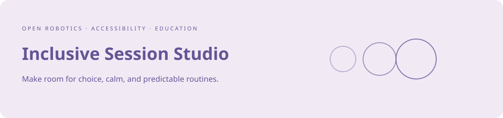
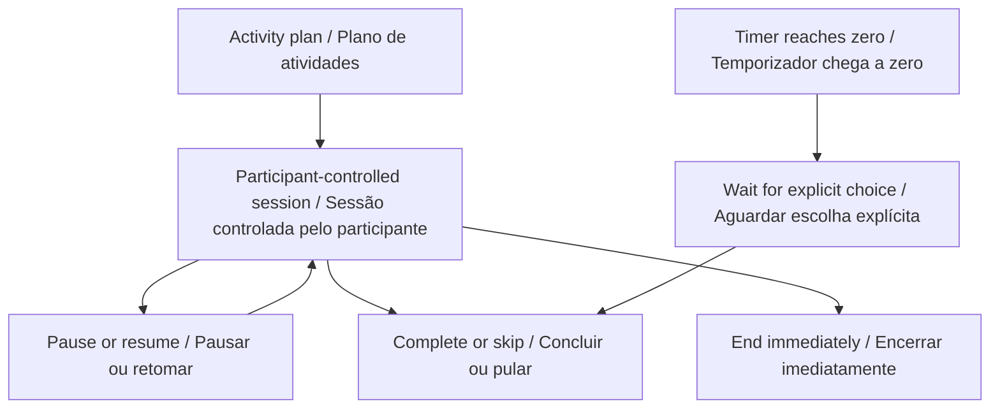

<div align="center">



# Inclusive Session Studio

[English](#english) · [Português](#portugues)

**Make room for choice, calm, and predictable routines.**

**Planeje atividades previsíveis, no ritmo da pessoa.**

[Live demo · Demonstração](https://galafis.github.io/inclusive-session-studio/) · [Architecture · Arquitetura](docs/ARCHITECTURE.md) · [Project guide · Guia do projeto](docs/FACILITATOR.md) · [Contribute · Contribuir](CONTRIBUTING.md)

[](https://github.com/galafis/inclusive-session-studio/actions/workflows/ci.yml)


</div>

<!-- connected-community:start -->
## Continue the demonstration · Continue a demonstração

**EN:** Prepare a session here, then explore printable invitation cards, explicit participant choices and a minimal public journal in the Python encounter kit.

**PT:** Prepare aqui uma sessão; depois explore cartões imprimíveis de convite, escolhas explícitas do participante e um diário público mínimo no kit de encontros em Python.

[Évia · My Encounter / Meu Encontro](https://github.com/galafis/evia-inclusive-encounter-kit) · [Connected walkthrough / Demonstração conectada](docs/CONNECTED_DEMO.md)

<!-- connected-community:end -->

<!-- domain-workflow:start -->

## Domain workflow · Fluxo do domínio



<!-- domain-workflow:end -->

<a id="english"></a>

## English

A private browser-based planner and player for predictable, optional activities. Build a visual sequence, customize invitations, and give the participant control over pacing. Designed for inclusive educational activities with children and adults, including autistic participants.

## Why this exists

A useful activity plan should make the next step clearer while preserving the freedom to decline it. This project supports facilitators who want predictable structure, simple language, quiet presentation, and a visible way to pause or finish.

## Unitree Go2 PRO research direction

This repository is a **working software prototype in a development program centered on the Unitree Go2 PRO**. It contributes to inclusive educational activities with children and adults, including autistic participants. The implementation, examples, and test suite provide a reviewable software baseline for the next stage of controlled hardware work.

The planner supplies the human-facing structure around an optional robotics encounter: what will happen, what can happen next, and how to pause or finish. Its robot-observation template explicitly leaves distance and participation to the person. A supported Go2 PRO could later serve as the stationary object of an optional, facilitator-led observation activity. It is not required to use the planner, and the application does not activate it.

### A concrete Go2 PRO example

A participant and facilitator prepare a four-step plan: choose a distance, optionally observe one detail of a stationary Go2 PRO, take a break, and finish. Watching from elsewhere or declining the activity remains a complete choice. The planner supplies predictable invitations and pause/end controls, without assessing behavior or claiming therapeutic benefit.

**Hardware access matters:** the standard PRO does not include secondary development in Unitree's comparison table. Custom integration therefore requires written vendor confirmation or a supported development configuration. The software currently has no device adapter. [Official Go2 configuration reference](https://www.unitree.com/go2/), checked September 10, 2026.

[Read the Go2 PRO hardware roadmap](docs/UNITREE_GO2_ROADMAP.md) for the proposed setup, measurements, acceptance criteria, and integration boundaries.

## What works today

| Capability                    | Implementation                                                                                          |
| ----------------------------- | ------------------------------------------------------------------------------------------------------- |
| Editable activity plans       | Three templates, 1–12 activities, reorder controls, editable invitations, and a 20-change undo history. |
| Participant-controlled pacing | Start, pause, resume, finish an activity early, skip, or end the session.                               |
| Quiet defaults                | Optional timer, no sounds or flashing effects, and no automatic move to the next activity.              |
| Portable local plans          | Device-local storage, validated JSON import/export, and a print-friendly plan.                          |
| Readable presentation         | Now/next preview, labeled controls, optional higher contrast, and age-neutral design.                   |

## Try it in two minutes

1. Choose **A gentle introduction** and select an activity to edit its invitation.
2. Move or remove activities, then use **Undo change** to compare the plan.
3. Start a session, pause it, and try **Skip activity** or **End session**.
4. Export the plan to keep a copy. Suggested times never force an activity change.

## Run locally

Use **Node.js 22 or newer**. No dependency installation, keys, or account is required.

```sh
git clone https://github.com/galafis/inclusive-session-studio.git
cd inclusive-session-studio
npm test
npm run examples
npm start
```

Open **http://127.0.0.1:4173**. The included development server listens only on your machine. Set the `PORT` environment variable if that port is already in use. The demo is a static application; it can also be hosted by any ordinary static web server. Open it over HTTP, rather than directly from a file, so browser modules load correctly.

## Executable example

The following code runs against the software module, without a robot:

```js
import { presetPlan, createSession, tick } from './src/session.js';

const plan = presetPlan('observation');
const session = tick(createSession(plan), 180);
console.log(session.status); // ready
console.log(session.index); // 0: the next activity was not forced
```

Open [examples/observation.json](examples/observation.json) for a complete input you can import through the demo. The [technical design](docs/ARCHITECTURE.md) documents accepted inputs, outputs, and assumptions.

## Project structure

```text
src/session.js       Pure domain logic and validation
src/app.js             Browser interaction and rendering
src/browser.js         Import, export, and text escaping
test/                  Behavioral regression tests
examples/              Synthetic, versioned JSON examples
docs/                  Architecture, evaluation, and facilitator material
scripts/serve.mjs       Local static development server
.github/workflows/     Linux and Windows checks on Node 22 and 24
```

## Verification

The current suite includes **30 automated tests**. Run `npm test` for the behavioral suite or `npm run test:coverage` for a local coverage report. The workflow runs the same suite on Linux and Windows with Node 22 and 24. See [validation notes](docs/VALIDATION.md) for the tested properties and remaining review work.

## Status and boundaries

This is an educational planning application, not an assessment, diagnostic, or treatment tool. No participant study or clinical benefit is claimed. The optional robot-observation template is a written plan only; the application does not connect to or operate hardware.

This is an independent project by **Gabriel Demetrios Lafis**. It does not claim endorsement by a hardware vendor, university, emergency service, or clinical organization. Institutional contact: **gabrieldemetrioslafis@usp.br**.

## Related open projects

[Accessible Route Lab](https://github.com/galafis/accessible-route-lab) · [Rescue Scenario Lab](https://github.com/galafis/rescue-scenario-lab)

The projects form a small portfolio for accessible mobility research, rescue education, and inclusive activity planning. They share a commitment to inspectable software and clear limits on demonstrated capability.

## Contributing and license

See [CONTRIBUTING.md](CONTRIBUTING.md) and [SECURITY.md](SECURITY.md). The source and documentation are available under the [MIT license](LICENSE). Suggestions from people with lived experience and relevant practitioners are especially welcome.

---

<a id="portugues"></a>

## Português

**[Abrir demonstração](https://galafis.github.io/inclusive-session-studio/)** · [Arquitetura](docs/ARCHITECTURE.md) · [Guia do projeto](docs/FACILITATOR.md) · [Roteiro de desenvolvimento com Go2 PRO](docs/UNITREE_GO2_ROADMAP.md)

### O que é este projeto

Planejador e reprodutor de atividades previsíveis e opcionais, com armazenamento local. Permite criar uma sequência visual, adaptar convites e preservar a escolha da pessoa sobre ritmo, pausas e encerramento.

É um **protótipo funcional de software em um programa de desenvolvimento direcionado ao Unitree Go2 PRO**. Sua contribuição está ligada a atividades educacionais inclusivas com crianças e adultos, incluindo participantes autistas. A implementação, os exemplos e a suíte de testes formam uma base de software verificável para a próxima etapa de trabalho controlado com o equipamento.

### Direção de pesquisa com o Unitree Go2 PRO

O planejador fornece a estrutura de uma interação opcional com robótica: o que acontecerá, qual pode ser a próxima etapa e como pausar ou encerrar. O modelo de observação do robô deixa a distância e a participação sob escolha da pessoa. Um Go2 PRO com suporte poderia ser, posteriormente, o objeto estacionário de uma atividade opcional conduzida por facilitador. Ele não é necessário para usar o planejador, e o aplicativo não o aciona.

**Exemplo concreto:** Participante e facilitador preparam quatro etapas: escolher a distância, observar opcionalmente um detalhe de um Go2 PRO estacionário, fazer uma pausa e encerrar. Observar de outro local ou recusar a atividade continua sendo uma escolha completa. O planejador oferece convites previsíveis e controles de pausa e encerramento, sem avaliar comportamento nem alegar benefício terapêutico.

**Acesso ao equipamento:** a configuração PRO padrão não inclui desenvolvimento secundário na tabela da Unitree. Integrações personalizadas dependem de confirmação escrita do fabricante ou de uma configuração de desenvolvimento suportada. Este software ainda não possui adaptador para o robô. Consulte a [referência oficial de configurações Go2](https://www.unitree.com/go2/), verificada em 10 de setembro de 2026.

### Funcionalidades implementadas

| Capacidade                         | Implementação                                                                                                          |
| ---------------------------------- | ---------------------------------------------------------------------------------------------------------------------- |
| Planos editáveis                   | Três modelos, de 1 a 12 atividades, reordenação, convites personalizados e histórico de 20 alterações para desfazer.   |
| Ritmo controlado pelo participante | Iniciar, pausar, retomar, concluir antes do tempo sugerido, pular ou encerrar a sessão.                                |
| Padrões tranquilos                 | Temporizador opcional, sem sons ou efeitos piscantes e sem avanço automático de atividade.                             |
| Planos locais e portáteis          | Armazenamento no dispositivo, importação e exportação JSON validada e impressão do plano.                              |
| Apresentação legível               | Prévia do agora e do próximo passo, controles identificados, contraste opcional e linguagem visual sem infantilização. |

### Experimente em dois minutos

1. Escolha **A gentle introduction** e selecione uma atividade para editar o convite.
2. Reordene ou remova atividades; use **Undo change** para recuperar o plano anterior.
3. Inicie uma sessão, pause e experimente **Pular atividade** ou **Encerrar sessão**.
4. Exporte o plano. O tempo sugerido nunca força a troca de atividade.

A demonstração e a documentação oferecem inglês e português. Use **Language / Idioma** para alternar a interface sem reiniciar o experimento. Todos os exemplos são sintéticos.

### Executar localmente

Requisito: **Node.js 22 ou superior**. Não é necessário instalar dependências, fornecer chaves ou criar uma conta.

```sh
git clone https://github.com/galafis/inclusive-session-studio.git
cd inclusive-session-studio
npm test
npm run examples
npm start
```

Abra **http://127.0.0.1:4173**. O servidor de desenvolvimento aceita conexões apenas da própria máquina. Se a porta estiver ocupada, configure a variável de ambiente `PORT`. A aplicação também pode ser publicada em um servidor comum de arquivos estáticos. Use HTTP, em vez de abrir o HTML diretamente como arquivo, para permitir o carregamento dos módulos.

### Exemplo executável

Este código executa o módulo do protótipo e não envia comandos ao equipamento:

```js
import { presetPlan, createSession, tick } from './src/session.js';

const plan = presetPlan('observation');
const session = tick(createSession(plan), 180);
console.log(session.status); // ready
console.log(session.index); // 0: the next activity was not forced
```

O arquivo [examples/observation.json](examples/observation.json) é um exemplo completo para importar pela demonstração. A [documentação de arquitetura](docs/ARCHITECTURE.md) explica formatos, resultados e premissas.

### Organização do repositório

| Caminho              | Finalidade                                                |
| -------------------- | --------------------------------------------------------- |
| `src/session.js`     | Regras do domínio e validação, independentes da interface |
| `src/app.js`         | Interações e apresentação no navegador                    |
| `src/browser.js`     | Importação, exportação e tratamento de texto              |
| `test/`              | Testes de comportamento e regressão                       |
| `examples/`          | Entradas JSON sintéticas e reproduzíveis                  |
| `docs/`              | Arquitetura, avaliação e material de facilitação          |
| `scripts/serve.mjs`  | Servidor estático de desenvolvimento local                |
| `.github/workflows/` | Verificações em Linux e Windows, com Node 22 e 24         |

### Testes e verificação

A suíte atual contém **30 testes automatizados**. Execute `npm test` para reproduzir a suíte, ou `npm run test:coverage` para gerar um relatório local de cobertura. O status de cada commit pode ser consultado na aba **Actions**.

A suíte verifica pausa sem consumo de tempo, avanço somente por escolha, encerramento imediato, reordenação, cópia independente do plano, validação de importações, limites de duração e tratamento seguro de texto. Não há pontuação ou penalidade por pular atividades.

As [notas de validação](docs/VALIDATION.md) distinguem as verificações de software das avaliações ainda necessárias com tecnologias assistivas, participantes e profissionais.

### Estado atual e próximos passos

É uma ferramenta de planejamento educacional, sem funções de avaliação, diagnóstico ou tratamento. Não foram realizados estudos com participantes nem demonstrados resultados clínicos. O modelo de observação é apenas um plano escrito e não conecta nem opera o robô.

1. **Disponível:** software funcional, demonstração, testes, exemplos e documentação.
2. **Proposto:** revisão participativa e avaliação por profissionais da área, com procedimentos adequados de consentimento e privacidade.
3. **Etapa de equipamento:** acesso ao Go2 PRO, confirmação dos recursos suportados e demonstrações físicas controladas.
4. **Dependente de desenvolvimento e validação adicionais:** qualquer integração programática ou uso com participantes que envolva equipamento físico.

### Autoria, colaboração e licença

Projeto independente de **Gabriel Demetrios Lafis**. Contato institucional: **gabrieldemetrioslafis@usp.br**. Não representa endosso de fabricante, universidade, serviço de emergência ou organização clínica.

Contribuições são bem-vindas conforme [CONTRIBUTING.md](CONTRIBUTING.md). Consulte [SECURITY.md](SECURITY.md) para relatar vulnerabilidades. Código e documentação estão sob a [licença MIT](LICENSE).

Projetos relacionados: [Accessible Route Lab](https://github.com/galafis/accessible-route-lab), [Rescue Scenario Lab](https://github.com/galafis/rescue-scenario-lab) e [Inclusive Session Studio](https://github.com/galafis/inclusive-session-studio).

[Voltar ao início](#english)

## Language and reproducible examples · Idioma e exemplos reproduzíveis

Use **Language / Idioma** in the demo header to switch between English and Portuguese. Changing the display language preserves the current experiment. The language preference and the current plan are saved locally, as described in the architecture guide. JSON identifiers and state codes remain stable. [Worked examples and expected results](docs/EXPERIMENTS.md) provide reproducible inputs and explicit numerical checks.

Use **Language / Idioma** no cabeçalho para alternar inglês e português. A troca preserva o experimento atual. A preferência de idioma e o plano atual são salvos localmente, conforme o guia de arquitetura. Identificadores JSON e códigos de estado permanecem iguais. Os [exemplos comentados e resultados esperados](docs/EXPERIMENTS.md) oferecem entradas reproduzíveis e verificações numéricas explícitas.

Templates are created in the selected language when loaded. Switching the interface language never rewrites an edited or imported invitation; select the desired language before loading a fresh template. Portuguese JSON plans are included in `examples/`.

Os modelos são criados no idioma selecionado ao carregá-los. Trocar o idioma da interface nunca reescreve um convite editado ou importado; selecione o idioma antes de carregar um novo modelo. Os planos JSON em português estão em `examples/`.
