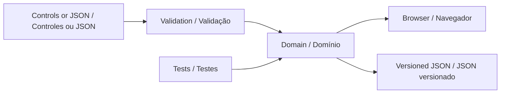

# Technical design

<!-- bilingual-support -->

[English](#english) · [Português](#português)

## English

Inclusive Session Studio uses browser-native modules and a pure domain module that also runs under Node. The application has no backend, runtime package dependencies, external fonts, or analytics. The UI and tests consume the same implementation.



## Plan contract

```js
import { presetPlan, createSession, tick, changeSession } from './src/session.js';

const plan = presetPlan('gentle');
let session = createSession(plan);
session = tick(session, 15);
session = changeSession(session, 'pause');
console.log(session.remaining); // 165 seconds
```

A version-1 plan contains a title, boolean display preferences, and 1–12 activities. Each activity has a unique identifier, a title of at most 80 characters, an invitation of at most 240 characters, a category, and an integer duration from 1 to 30 minutes. Validation trims text, copies nested data, and discards unknown fields.

## Session state

| State      | Clock behavior            | Available transitions                |
| ---------- | ------------------------- | ------------------------------------ |
| `running`  | Decrements remaining time | pause, complete, skip, end           |
| `paused`   | No elapsed time           | resume, complete, skip, end          |
| `ready`    | Remains at zero           | complete, skip, end                  |
| `finished` | No elapsed time           | Start a new session in the interface |
| `ended`    | No elapsed time           | Start a new session in the interface |

The engine never advances an activity in response to a clock tick. Reaching zero only changes `running` to `ready`. Completing or skipping the last activity produces `finished`. Ending from any active state produces `ended`. There is no score, compliance metric, or completion reward.

`createSession` snapshots the plan. Editing controls are disabled while the session is active, so the sequence does not change unexpectedly. Display preferences remain adjustable. The browser samples a monotonic clock every 250 milliseconds and applies the actual elapsed interval. Background tab throttling can delay the displayed update, but cannot trigger automatic progression. Suggested time can elapse while a tab is in the background; pause explicitly to stop the session clock.

## Local persistence

Only the current plan and display preferences are stored under `inclusive-session-studio.plan.v1`. Session history stays in memory and is not exported or persisted. There is no remote database. Storage failure is visible in the interface; JSON export remains available. Clearing this site's browser storage removes the saved plan.

Undo stores at most 20 plan snapshots in memory. Refreshing clears undo history. A JSON import is validated completely before replacing a plan. All imported text is escaped or assigned as text; executable markup is never accepted as rendered content.

## Hosting and maintenance

The repository root is deployable as static files on GitHub Pages. `.nojekyll` prevents template processing. The development server rejects hidden and out-of-root paths; it is not intended as an internet-facing production service. GitHub Actions has read-only repository permissions. There is no build step and no package lockfile because there are no package dependencies.

## Português

### Contrato do plano

O módulo `src/session.js` funciona no navegador e no Node. No exemplo em inglês, o primeiro convite dura 180 segundos; após `tick(session, 15)` e uma pausa, restam 165 segundos.

Um plano de versão 1 contém título, preferências booleanas e de 1 a 12 atividades. Cada atividade tem identificador único, título de até 80 caracteres, convite de até 240 caracteres, categoria e duração inteira de 1 a 30 minutos. A validação remove espaços nas extremidades, copia os dados aninhados e descarta campos desconhecidos.

### Estados da sessão

| Estado     | Relógio                | Transições                                   |
| ---------- | ---------------------- | -------------------------------------------- |
| `running`  | Reduz o tempo restante | Pausar, concluir atividade, pular, encerrar  |
| `paused`   | Não avança             | Retomar, concluir atividade, pular, encerrar |
| `ready`    | Permanece em zero      | Concluir atividade, pular, encerrar          |
| `finished` | Não avança             | Iniciar outra sessão na interface            |
| `ended`    | Não avança             | Iniciar outra sessão na interface            |

O relógio nunca avança automaticamente para outra atividade. Chegar a zero apenas altera `running` para `ready`. Concluir ou pular a última atividade produz `finished`; encerrar uma sessão ativa produz `ended`. Não há pontuação, métrica de obediência ou recompensa por conclusão.

`createSession` copia o plano. A edição da sequência fica indisponível durante uma sessão ativa para evitar mudanças inesperadas; as preferências visuais continuam ajustáveis. A interface consulta um relógio monotônico a cada 250 ms e aplica o tempo efetivamente transcorrido. Uma aba em segundo plano pode atrasar a atualização visual, mas não dispara a próxima atividade. Pause explicitamente para interromper o relógio.

### Persistência local

Somente o plano e as preferências ficam em `inclusive-session-studio.plan.v1`. O histórico da sessão permanece em memória, sem exportação nem persistência. Não existe banco remoto. Falhas de armazenamento ficam visíveis e a exportação JSON continua disponível. Limpar os dados deste site remove o plano salvo.

Desfazer guarda até 20 cópias do plano em memória; atualizar a página apaga esse histórico. Uma importação é completamente validada antes de substituir o plano. Textos importados são escapados ou inseridos como texto, sem renderizar marcação executável.

### Hospedagem e manutenção

A aplicação usa módulos nativos, sem servidor de aplicação, dependências de execução, fontes externas ou análise de uso. A interface e os testes usam a mesma implementação do domínio. A raiz pode ser hospedada como arquivos estáticos no GitHub Pages; `.nojekyll` evita processamento de templates. O servidor local recusa caminhos ocultos e fora da raiz, escuta apenas em `127.0.0.1` e não é um serviço de produção. O workflow de testes usa permissões de leitura. Não há etapa de compilação nem dependências a instalar.

### Language presentation · Apresentação do idioma

`src/i18n.js` translates visible text and accessible labels at the view boundary. It observes dynamic view updates and retains the original text for reversible language switching. It does not rebuild controls or mutate domain state. Text marked `data-verbatim`, including authored session invitations, stays unchanged. The language preference uses `portfolio.language.v1`; storage failure does not prevent use.

`src/i18n.js` traduz texto visível e rótulos acessíveis na camada de apresentação. Observa atualizações da interface e preserva o texto original para permitir a troca reversível. Não recria controles nem altera o estado do domínio. Textos com `data-verbatim`, incluindo convites editados, permanecem iguais. A preferência usa `portfolio.language.v1`; falhas de armazenamento não impedem o uso.
