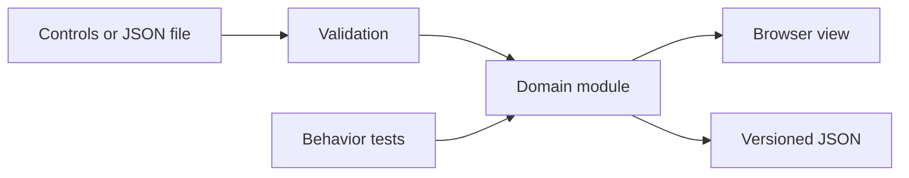

# Technical design

Inclusive Session Studio uses browser-native modules and a pure domain module that also runs under Node. The application has no backend, runtime package dependencies, external fonts, or analytics. The UI and tests consume the same implementation.



## Plan contract

```js
import { presetPlan, createSession, tick, changeSession } from './src/session.js';

const plan = presetPlan('gentle');
let session = createSession(plan);
session = tick(session, 15);
session = changeSession(session, 'pause');
console.log(session.remaining); // 165 seconds
```

A version-1 plan contains a title, boolean display preferences, and 1–12 activities. Each activity has a unique identifier, a title of at most 80 characters, an invitation of at most 240 characters, a category, and an integer duration from 1 to 30 minutes. Validation trims text, copies nested data, and discards unknown fields.

## Session state

| State | Clock behavior | Available transitions |
|---|---|---|
| `running` | Decrements remaining time | pause, complete, skip, end |
| `paused` | No elapsed time | resume, complete, skip, end |
| `ready` | Remains at zero | complete, skip, end |
| `finished` | No elapsed time | Start a new session in the interface |
| `ended` | No elapsed time | Start a new session in the interface |

The engine never advances an activity in response to a clock tick. Reaching zero only changes `running` to `ready`. Completing or skipping the last activity produces `finished`. Ending from any active state produces `ended`. There is no score, compliance metric, or completion reward.

`createSession` snapshots the plan. Editing controls are disabled while the session is active, so the sequence does not change unexpectedly. Display preferences remain adjustable. The browser samples a monotonic clock every 250 milliseconds and applies the actual elapsed interval. Background tab throttling can delay the displayed update, but cannot trigger automatic progression. Suggested time can elapse while a tab is in the background; pause explicitly to stop the session clock.

## Local persistence

Only the current plan and display preferences are stored under `inclusive-session-studio.plan.v1`. Session history stays in memory and is not exported or persisted. There is no remote database. Storage failure is visible in the interface; JSON export remains available. Clearing this site's browser storage removes the saved plan.

Undo stores at most 20 plan snapshots in memory. Refreshing clears undo history. A JSON import is validated completely before replacing a plan. All imported text is escaped or assigned as text; executable markup is never accepted as rendered content.


## Hosting and maintenance

The repository root is deployable as static files on GitHub Pages. `.nojekyll` prevents template processing. The development server rejects hidden and out-of-root paths; it is not intended as an internet-facing production service. GitHub Actions has read-only repository permissions. There is no build step and no package lockfile because there are no package dependencies.
